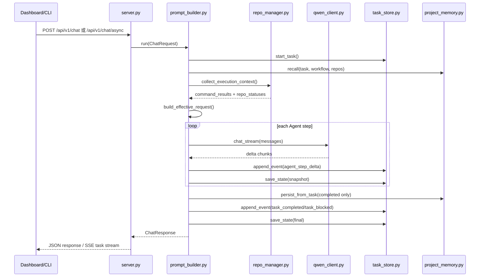

# 美业 SaaS Agent Runtime

这是一个可以直接读取你现有 `docx` 提示词、编排 Agent/Skill，并调用本地模型服务的轻量项目骨架。

项目默认假设你的本地 Qwen 已经通过以下任一方式暴露接口：

- OpenAI 兼容接口，例如 `vLLM`、`LM Studio`、`Xinference`
- `Ollama` 的本地接口

当前实现不依赖第三方 Python 包，方便你先把流程跑起来，再按需要扩展到 FastAPI、数据库、前端等完整架构。

当前默认架构已经升级为“多 Agent，单模型服务”：

- `OrchestratorAgent`：统一版本、任务拆解、路由和汇总
- `BackendAgent`：后端分析、开发、测试、接口文档
- `FrontendAgent`：前端分析、开发、UI、自测
- `OpsAgent`：数据库、监控、规范、部署

这 4 个 Agent 共用同一个本地模型服务，不需要在本机并发启动多份模型。

## 文档导航

- 快速上手主链路：`README.md`（本文）
- Agent 接手指南：`AGENT_ONBOARDING.md`
- 任务操作顺序：`OPERATION_FLOW.md`
- 工作区真实配置：`.agent/workspace-profile.local.json`

## 最短启动路径（3 分钟）

如果你只关心“项目怎么跑起来”，按下面执行即可。

1. 进入项目目录

```bash
cd /Users/wmb/IdeaProjects/myself/wmb-agent
```

2. 准备环境变量（首次）

```bash
cp .env.example .env
```

3. 选择一个启动模式并启动服务（推荐 `dev`）

```bash
# 低负载开发模式（推荐日常使用）
./scripts/start-agent-dev.sh

# 高质量推理模式（35B）
# ./scripts/start-agent-hq.sh

# 稳定排障模式（更高超时和重试）
# ./scripts/start-agent-stable.sh
```

4. 打开控制台

```text
http://127.0.0.1:8787/dashboard
```

5. 验证服务是否正常

```bash
curl http://127.0.0.1:8787/health
```

6. 停止服务

- 如果你是前台启动（上面脚本默认前台）：`Ctrl + C`
- 如果你让 agent 拉起了前后端业务进程，可执行：

```bash
curl -X POST http://127.0.0.1:8787/api/v1/runtime/processes/stop \
  -H 'Content-Type: application/json' \
  -d '{"phase":"start"}'
```

## 当前默认联调配置（luozuo）

当前工作区已经按本地联调习惯预置了以下约定：

- 后端启动目标服务：`gateway-server`、`system-server`、`infra-server`、`shop-server`
- 前端开发地址：`http://127.0.0.1:5777`
- 网关地址：`http://127.0.0.1:48080`
- Nacos 使用远端地址：`<YOUR_NACOS_HOST:PORT>`（注意是 `host:port`，不是 `/nacos` 控制台路径）
- 默认注册命名空间：`<YOUR_NACOS_NAMESPACE_ID>`

## Agent 快速上手

如果你准备把项目交给新的 agent，建议先让它阅读这三份文件：

1. `README.md`
2. `AGENT_ONBOARDING.md`
3. `.agent/workspace-profile.local.json`

如果你自己要顺着完整链路使用项目，也建议补看：

4. `OPERATION_FLOW.md`

其中：

- `AGENT_ONBOARDING.md` 负责告诉 agent 改控制台前端、后端接口、任务存储时分别该先看哪里
- `.agent/workspace-profile.local.json` 负责告诉 agent 外部前后端仓库、工具链、服务地址和启动命令
- `README.md` 负责给出项目整体目标和运行方式
- `OPERATION_FLOW.md` 负责说明从启动服务、测试模型、发布任务到测试验收的推荐操作顺序

系统也会把每次任务执行持久化到本地：

- SQLite 汇总表：便于任务列表查询
- JSON 快照：便于回看每个 Agent 步骤、handoff 和最终输出

本地仓库配置也支持独立管理：

- 工作区配置文件：仓库地址、分支、工具链、同步规则
- 本地 secrets 文件：Git 账号密码
- Git 同步策略默认只允许 `clone/fetch/checkout/pull --ff-only/status`
- 默认禁止删分支、强推、`reset --hard`

## 功能

- 直接读取 `.docx` 中定义的总控 Agent Prompt
- 自动解析 Skill 清单、执行流程、强制约束
- 支持通过 `workflow` 或 `skills` 选择本次调用启用的能力
- 兼容 OpenAI 风格和 Ollama 风格的本地模型接口
- 支持列出本地模型和执行模型连通性自检
- 支持在控制台系统中心一键切换模型模式（低负载 `dev` / 高质量 `hq`），并即时生效
- 支持配置前后端代码仓库、分支、Maven 和本地 Git 拉取规则
- 支持安全同步仓库并查看本地代码状态
- 支持按 `start_commands` 真正启动前后端项目
- 支持 Prompt 版本注册与激活
- 支持 Skill 插件目录注册
- 支持把 GitHub 上的外部 Skill 导入到项目并自动注册
- 支持任务执行事件流与聚合摘要
- 自带零构建的本地管理台
- 支持交流工作台、任务收藏/搜索和自动验收报告
- 支持三视图拆分：任务编排 / 任务追踪 / 系统中心
- 支持任务详情弹窗（任务追踪页直接查看完整链路）
- 支持运行进程管理（按进程停止、按仓库停止、一键关闭前后端项目）
- 支持项目重点记忆（流程记忆 / 关联实体记忆），可自动召回并在成功任务后增量沉淀
- 提供 CLI 和 HTTP API 两种调用方式
- 支持把 `docx` 中的 Skill 拆分导出成独立 Markdown 文件和清单
- 支持导出标准化 Skill 模板，补齐输入、输出、约束、执行清单和交接对象
- 支持多 Agent 编排、Agent 注册表、任务状态流转和 handoff 交接

## 目录结构

```text
.
├── README.md
├── pyproject.toml
├── src/beauty_saas_agent
│   ├── cli.py
│   ├── config.py
│   ├── docx_loader.py
│   ├── models.py
│   ├── prompt_builder.py
│   ├── project_memory.py
│   ├── prompt_parser.py
│   ├── qwen_client.py
│   ├── server.py
│   └── workflows.py
└── tests
    ├── test_docx_loader.py
    └── test_prompt_parser.py
```

## 代码阅读地图（推荐顺序）

如果你现在直接看代码容易迷路，建议按下面顺序看。  
先看“数据结构”，再看“请求如何执行”，最后看“任务如何落盘和回放”。

建议阅读顺序：

1. `src/beauty_saas_agent/models.py`
- 先认清所有核心数据结构：`ChatRequest`、`ExecutionPlan`、`ExecutionCommandResult`、`ChatResponse`、`TaskEvent`。
- 这一步做完后，后面看到字段不会陌生。

2. `src/beauty_saas_agent/config.py` + `src/beauty_saas_agent/workspace_profile.py`
- 看配置从哪里来：`.env`、workspace profile、secrets。
- 看清“仓库、工具链、服务地址、启动命令”是如何进入运行时的。

3. `src/beauty_saas_agent/prompt_parser.py` + `src/beauty_saas_agent/prompt_registry.py`
- 看 docx Prompt 如何被解析成结构化定义。
- 看 Prompt 多版本如何注册、激活、切换。

4. `src/beauty_saas_agent/plugin_skill_loader.py` + `src/beauty_saas_agent/skill_plugin_registry.py` + `src/beauty_saas_agent/github_skill_importer.py`
- 看外部 Skill 是如何导入、注册、加载、合并的。
- 这部分已经补了分阶段中文注释，按函数顺序读就行。

5. `src/beauty_saas_agent/prompt_builder.py`（重点）
- 先看 `run()`：这是任务主链路入口。
- 再看 `build_effective_request()`、`collect_execution_context()`、`build_execution_recommendations()`，理解阻断与自动建议如何生成。
- 最后看 `_collect_streamed_step_output()`，理解流式输出和事件推送。

6. `src/beauty_saas_agent/repo_manager.py`
- 看执行模式如何真正调用仓库命令（前台/后台）。
- 看后台进程注册、查询、停止和日志定位。

7. `src/beauty_saas_agent/task_store.py`
- 看任务如何保存为“JSON 快照 + SQLite 索引 + 事件流”。
- 看任务详情页为什么能回放完整执行链路。

8. `src/beauty_saas_agent/server.py`
- 最后看 API 层：GET/POST 路由如何调用 runtime。
- 已按阶段拆分注释：健康检查、元数据、任务流、异步执行。

按问题类型快速定位：

- 看“为什么这个任务被阻断”：`prompt_builder.py` + `execution_diagnostics.py`
- 看“为什么服务没真正启动”：`repo_manager.py`
- 看“为什么任务详情/事件不完整”：`task_store.py` + `server.py`
- 看“为什么某个 Skill 没生效”：`plugin_skill_loader.py` + `skill_plugin_registry.py`
- 看“为什么模型调用失败”：`qwen_client.py` + `.env` 模型配置

10 分钟速读建议：

1. 先读 `models.py`（2 分钟）
2. 再读 `prompt_builder.py` 里的 `run()`（4 分钟）
3. 然后读 `repo_manager.py` 的命令执行和进程管理（2 分钟）
4. 最后读 `task_store.py` 的落盘与查询（2 分钟）

## 任务执行时序图（Mermaid）

下面这张图对应 `prompt_builder.py` 的主链路，可以和 `run()` 一起对照阅读：



时序图阅读要点：

- `server.py` 只负责路由和请求编排，不做业务决策。
- `prompt_builder.py` 是主调度器，负责“执行 + 诊断 + 汇总 + 持久化”。
- `repo_manager.py` 负责工作区命令与后台进程生命周期。
- `task_store.py` 负责“快照 + 索引 + 事件流”三套数据。
- `project_memory.py` 只沉淀成功任务中的可复用项目经验。

## 快速开始

1. 复制环境变量模板

```bash
cp .env.example .env
```

2. 按你的本地模型服务修改 `.env`

Ollama 示例：

```env
MODEL_PROVIDER=ollama
MODEL_BASE_URL=http://127.0.0.1:11434
MODEL_NAME=deepseek-coder-v2:16b
MODEL_MODE=dev
MODEL_NAME_DEV=deepseek-coder-v2:16b
MODEL_NAME_HQ=qwen3.6:35b
MODEL_API_KEY=
```

推荐把模型分成两个模式：

- `dev`（日常开发，低内存）：`MODEL_NAME_DEV`，如 `deepseek-coder-v2:16b`
- `hq`（高质量推理）：`MODEL_NAME_HQ`，如 `qwen3.6:35b`

可直接用脚本切换：

```bash
# 查看当前模式
./scripts/switch-model-mode.sh status

# 切到低负载开发模式
./scripts/switch-model-mode.sh dev

# 切到高质量模式（35B）
./scripts/switch-model-mode.sh hq
```

也可以在控制台 `系统中心 -> 模型模式切换` 里直接点击按钮切换，无需手动改 `.env` 或重启服务。

如果你希望“不同命令直接启动不同配置”，可以直接使用预置 profile：

```bash
# 低负载开发（deepseek 16b）
./scripts/start-agent-dev.sh

# 高质量推理（qwen 35b）
./scripts/start-agent-hq.sh

# 稳定排障（更高超时与更强重试）
./scripts/start-agent-stable.sh
```

对应配置文件在：

- `env/profiles/dev.env`
- `env/profiles/hq.env`
- `env/profiles/stable.env`

通用入口脚本也支持按参数启动：

```bash
# 按 profile 启动
./scripts/start-agent.sh --profile dev
./scripts/start-agent.sh --profile hq
./scripts/start-agent.sh --profile stable

# 按自定义配置文件启动
./scripts/start-agent.sh --env-file /absolute/path/to/custom.env
```

项目内 GitHub 推送配置（不依赖本机 `~/.ssh/config`）：

```bash
# 1) 编辑项目内推送配置（不上传）
vim env/git-push.local.env

# 2) 一键推送（使用配置里的 SSH key）
./scripts/git-push.sh
```

示例模板：`env/git-push.example.env`

OpenAI 兼容接口示例：

```env
MODEL_PROVIDER=openai-compatible
MODEL_BASE_URL=http://127.0.0.1:8000/v1
MODEL_NAME=qwen-v2
MODEL_API_KEY=EMPTY
```

模型请求韧性策略（重试 + 退避 + 熔断）：

```env
MODEL_RETRY_ATTEMPTS=2
MODEL_RETRY_BACKOFF_MS=400
MODEL_RETRY_BACKOFF_MAX_MS=3000
MODEL_CIRCUIT_FAIL_THRESHOLD=3
MODEL_CIRCUIT_OPEN_SECONDS=20
```

任务留存治理（自动清理 + 归档）：

```env
TASK_AUTO_CLEANUP=1
TASK_RETENTION_DAYS=30
TASK_EVENT_RETENTION_DAYS=30
TASK_MAX_RUNS=2000
TASK_ARCHIVE_PRUNED=1
```

项目重点记忆（独立 MySQL 库）示例：

```env
MEMORY_ENABLED=1
MEMORY_MYSQL_BIN=/Applications/ServBay/bin/mysql
MEMORY_MYSQL_HOST=127.0.0.1
MEMORY_MYSQL_PORT=3306
MEMORY_MYSQL_USER=root
MEMORY_MYSQL_PASSWORD=CHANGE_ME
MEMORY_MYSQL_DATABASE=wmb_agent_memory
MEMORY_RECALL_LIMIT=6
MEMORY_FETCH_LIMIT=200
```

3. 先检查本地模型服务

```bash
PYTHONPATH=src python3 -m beauty_saas_agent.cli model-list
PYTHONPATH=src python3 -m beauty_saas_agent.cli model-check
```

如果你启用了项目记忆，建议先确认本地 MySQL 可连接（首次运行会自动创建独立库与表）：

```bash
/Applications/ServBay/bin/mysql -h127.0.0.1 -P3306 -uroot -p'<your_password>' -e "SELECT VERSION();"
```

4. 查看仓库配置

```bash
PYTHONPATH=src python3 -m beauty_saas_agent.cli repo-meta
PYTHONPATH=src python3 -m beauty_saas_agent.cli repo-status
```

5. 首次拉取代码

```bash
PYTHONPATH=src python3 -m beauty_saas_agent.cli repo-sync
```

6. 查看 Prompt、Skill 和仪表盘摘要

```bash
PYTHONPATH=src python3 -m beauty_saas_agent.cli prompt-list
PYTHONPATH=src python3 -m beauty_saas_agent.cli skill-plugins
PYTHONPATH=src python3 -m beauty_saas_agent.cli dashboard-summary
```

7. 启动 HTTP 服务

推荐用启动脚本（可带模式）：

```bash
# 按当前 .env 模式启动
./scripts/start-agent.sh

# 一键切到 dev 后启动
./scripts/start-agent.sh dev

# 一键切到 hq 后启动
./scripts/start-agent.sh hq
```

或使用原始命令：

```bash
PYTHONPATH=src python3 -m beauty_saas_agent.server
```

8. 打开本地管理台

```text
http://127.0.0.1:8787/dashboard
```

9. 查看解析后的 Agent/Skill 元信息

```bash
curl http://127.0.0.1:8787/api/v1/meta
```

（可选）查看 / 切换当前模型模式：

```bash
curl http://127.0.0.1:8787/api/v1/model/mode
curl -X POST http://127.0.0.1:8787/api/v1/model/mode \
  -H 'Content-Type: application/json' \
  -d '{"mode":"dev"}'
```

10. 发起一次任务调用

```bash
curl -X POST http://127.0.0.1:8787/api/v1/chat \
  -H 'Content-Type: application/json' \
  -d '{
    "version": "v1.0.0",
    "workflow": "full_iteration",
    "task": "为会员充值场景设计后端接口与测试方案",
    "context": {
      "project_stack": "Ruoyi-Vue3",
      "business_domain": "美业SaaS"
    }
  }'
```

11. 发起异步任务（推荐用于启动项目等长任务）

```bash
curl -X POST http://127.0.0.1:8787/api/v1/chat/async \
  -H 'Content-Type: application/json' \
  -d '{
    "version": "v1.0.0",
    "workflow": "full_iteration",
    "task": "启动当前前后端项目并汇报阻断项",
    "execution_mode": "start",
    "repos": ["backend", "frontend"]
  }'
```

12. 停止运行中的前后端进程（对应控制台“关闭前后端项目”）

```bash
curl -X POST http://127.0.0.1:8787/api/v1/runtime/processes/stop \
  -H 'Content-Type: application/json' \
  -d '{"phase":"start"}'
```

## 控制台视图说明

控制台页面已拆分为三个视图，建议按以下方式使用：

- 任务编排：发需求、补上下文、触发执行；默认自动模式已开启（`full_iteration`，并按任务语义自动在 `start/validate` 间选择）
- 任务追踪：筛选近期任务、收藏任务、打开“任务详情弹窗”看完整步骤和事件流
- 系统中心：看模型连通、仓库状态、服务信息、运行进程，并支持重载配置/模型检测/模型模式切换（dev/hq）

常用快捷操作：

- `关闭前后端项目`：停止所有 `phase=start` 的后台进程
- `查看详情弹窗`：在任务追踪处快速打开完整详情，不再占用右侧固定面板
- `快速重跑`：沿用原请求，覆盖 execution mode 后再次执行

### 借鉴 Superpowers 的执行门禁（推荐）

为了降低“看起来流转正常但结果不可用”的概率，建议按下面 5 个门禁执行任务：

1. `Define`：先明确目标和验收标准，不清楚就先补问题边界。
2. `Plan`：先拆任务再写代码，尽量做到每一步都有文件路径、命令和可验证结果。
3. `Build`：后端/前端仅在“修改面独立、没有共享状态冲突”时并行；否则按依赖顺序串行。
4. `Verify`：至少执行一次回归或质量审计，再给结论，避免只看单条日志就宣布完成。
5. `Close`：任务结束后输出阻断与恢复建议，并可一键关闭后台进程，保持环境可复现。

并行派工建议（借鉴 `dispatching-parallel-agents` 思路）：

- 适合并行：多个失败点根因独立、修改文件集合基本不重叠、互不依赖上下文。
- 不适合并行：同一链路故障、共享状态强耦合、需要先修上游才能验证下游。
- 执行顺序建议：`orchestrator` 拆分 -> `backend/frontend` 并行（可并行时）-> `ops` 收口校验。

## CLI 用法

列出技能：

```bash
PYTHONPATH=src python3 -m beauty_saas_agent.cli skills
```

列出 Agent：

```bash
PYTHONPATH=src python3 -m beauty_saas_agent.cli agents
```

列出本地模型：

```bash
PYTHONPATH=src python3 -m beauty_saas_agent.cli model-list
```

检查模型连接：

```bash
PYTHONPATH=src python3 -m beauty_saas_agent.cli model-check
```

查看仓库配置：

```bash
PYTHONPATH=src python3 -m beauty_saas_agent.cli repo-meta
```

查看仓库状态：

```bash
PYTHONPATH=src python3 -m beauty_saas_agent.cli repo-status
```

同步仓库：

```bash
PYTHONPATH=src python3 -m beauty_saas_agent.cli repo-sync
PYTHONPATH=src python3 -m beauty_saas_agent.cli repo-sync --name backend
```

列出 Prompt 版本：

```bash
PYTHONPATH=src python3 -m beauty_saas_agent.cli prompt-list
```

注册新的 Prompt：

```bash
PYTHONPATH=src python3 -m beauty_saas_agent.cli prompt-register --path /absolute/path/to/prompt.docx --label beauty-v2
```

激活 Prompt：

```bash
PYTHONPATH=src python3 -m beauty_saas_agent.cli prompt-activate --prompt-id <prompt_id>
```

列出 Skill 插件：

```bash
PYTHONPATH=src python3 -m beauty_saas_agent.cli skill-plugins
```

注册 Skill 插件目录：

```bash
PYTHONPATH=src python3 -m beauty_saas_agent.cli skill-plugin-register --name my-skills --source-dir /absolute/path/to/skills
```

注册 Skill 插件目录并指定默认 Agent：

```bash
PYTHONPATH=src python3 -m beauty_saas_agent.cli skill-plugin-register \
  --name my-frontend-skills \
  --source-dir /absolute/path/to/skills \
  --owner-agent frontend
```

从 GitHub 导入外部 Skill：

```bash
PYTHONPATH=src python3 -m beauty_saas_agent.cli skill-plugin-import-github \
  --name openai-frontend \
  --repo openai/skills \
  --path skills/.curated/frontend-prototyper \
  --owner-agent frontend
```

从 GitHub URL 直接导入：

```bash
PYTHONPATH=src python3 -m beauty_saas_agent.cli skill-plugin-import-github \
  --name openai-docs-plugin \
  --url https://github.com/openai/skills/tree/main/skills/.curated/openai-docs
```

使用已固化的外部 Skill 工作流：

```bash
PYTHONPATH=src python3 -m beauty_saas_agent.cli run \
  --version v1.0.1 \
  --workflow frontend_enhanced \
  --task "提升会员充值页面视觉层级并补浏览器回归检查"
```

```bash
PYTHONPATH=src python3 -m beauty_saas_agent.cli run \
  --version v1.0.1 \
  --workflow backend_tdd \
  --task "按测试驱动方式实现储值卡充值接口"
```

```bash
PYTHONPATH=src python3 -m beauty_saas_agent.cli run \
  --version v1.0.1 \
  --workflow quality_audit \
  --task "对本次改动做质量与供应链风险审计"
```

```bash
PYTHONPATH=src python3 -m beauty_saas_agent.cli run \
  --version v1.0.1 \
  --workflow release_guard \
  --task "做一次发布前安全、CI 和监控守护检查"
```

```bash
PYTHONPATH=src python3 -m beauty_saas_agent.cli run \
  --version v1.0.1 \
  --workflow frontend_visual_upgrade \
  --task "把会员档案页做成更有层次的商业化界面"
```

```bash
PYTHONPATH=src python3 -m beauty_saas_agent.cli run \
  --version v1.0.1 \
  --workflow frontend_regression \
  --task "针对会员充值与订单流转做一次前端回归检查"
```

```bash
PYTHONPATH=src python3 -m beauty_saas_agent.cli run \
  --version v1.0.1 \
  --workflow backend_api_tdd \
  --task "按接口交付闭环方式实现会员充值 API"
```

```bash
PYTHONPATH=src python3 -m beauty_saas_agent.cli run \
  --version v1.0.1 \
  --workflow backend_change_review \
  --task "复核本次后端改动的覆盖率、差异风险和静态扫描结果"
```

```bash
PYTHONPATH=src python3 -m beauty_saas_agent.cli run \
  --version v1.0.1 \
  --workflow full_iteration_pro \
  --task "按计划驱动方式并行完成前后端改动，并在收口阶段完成质量校验"
```

```bash
PYTHONPATH=src python3 -m beauty_saas_agent.cli run \
  --version v1.0.1 \
  --workflow bug_fix_deep \
  --task "先自动定位登录失败根因，再按最小改动修复并回归验证"
```

列出任务历史：

```bash
PYTHONPATH=src python3 -m beauty_saas_agent.cli tasks --limit 10
```

查看单个任务详情：

```bash
PYTHONPATH=src python3 -m beauty_saas_agent.cli task-show --task-id <task_id>
```

查看任务事件流：

```bash
PYTHONPATH=src python3 -m beauty_saas_agent.cli task-events --task-id <task_id>
```

查看管理台摘要：

```bash
PYTHONPATH=src python3 -m beauty_saas_agent.cli dashboard-summary
```

搜索项目重点记忆：

```bash
PYTHONPATH=src python3 -m beauty_saas_agent.cli memory-search \
  --task "新增页面并联调数据库配置" \
  --workflow full_iteration \
  --repo backend frontend \
  --limit 5
```

直接调用模型：

```bash
PYTHONPATH=src python3 -m beauty_saas_agent.cli run \
  --version v1.0.0 \
  --workflow full_iteration \
  --task "输出一个新增会员档案管理模块的实施方案"
```

带工作区执行证据运行：

```bash
PYTHONPATH=src python3 -m beauty_saas_agent.cli run \
  --version v1.0.1 \
  --workflow backend_api_tdd \
  --execution-mode validate \
  --repo backend \
  --task "结合当前仓库测试结果，评估会员充值 API 的交付方案"
```

显式指定 Agent 路线：

```bash
PYTHONPATH=src python3 -m beauty_saas_agent.cli run \
  --version v1.0.0 \
  --agents orchestrator backend frontend ops \
  --skills BackendCodeWriteSkill FrontendCodeWriteSkill \
  --task "规划会员档案模块的前后端联动方案"
```

导出 Skill 文件：

```bash
PYTHONPATH=src python3 -m beauty_saas_agent.cli export-skills --output-dir skills/generated
```

导出后会生成：

- `skills/generated/README.md`
- `skills/generated/skill-manifest.json`
- 每个 Skill 一份独立的 `.md`

导出标准化 Skill 模板：

```bash
PYTHONPATH=src python3 -m beauty_saas_agent.cli export-standard-skills --output-dir skills/standardized
```

导出后会生成：

- `skills/standardized/README.md`
- `skills/standardized/skill-manifest.standard.json`
- 每个 Skill 一份标准模板 `.md`

标准化模板中的输入、输出、约束和交接项，是在保留原始 Prompt 的前提下做的结构化整理，适合后续直接接入你的本地 agent。

## HTTP API

### `GET /health`

返回服务状态和当前模型配置。

### `GET /api/v1/meta`

返回当前 Prompt 文档标题、已解析 Skill、预置工作流和配置摘要。

### `GET /dashboard`

打开本地管理台页面。

### `GET /api/v1/dashboard/summary`

返回任务、插件、Prompt、仓库的聚合摘要。

### `POST /api/v1/prompts/reload`

重载 Prompt/Skill/workflow 与工作区配置（适合修改 `.agent/*.json` 后立即生效）。

### `GET /api/v1/prompts`

返回 Prompt 版本注册表。

### `POST /api/v1/prompts/register`

注册新的 Prompt 文件。

### `POST /api/v1/prompts/activate`

激活指定 Prompt 版本。

### `GET /api/v1/skills/plugins`

返回 Skill 插件注册表。

### `POST /api/v1/skills/plugins/register`

注册新的 Skill 插件目录。

### `POST /api/v1/skills/plugins/import-github`

从 GitHub 仓库路径导入 Skill，并自动写入项目内插件目录与注册表。

### `GET /api/v1/repos/meta`

返回仓库配置、工具链信息和 Git 安全策略。

### `GET /api/v1/repos/status`

返回本地仓库状态，可选 `?name=backend`。

### `GET /api/v1/runtime/processes`

返回当前后台运行进程（来自 `.data/processes/runtime-processes.json`）。

### `POST /api/v1/runtime/processes/stop`

停止后台运行进程。支持按仓库和 phase 过滤。

请求示例：

```json
{
  "repo_names": ["backend", "frontend"],
  "phase": "start"
}
```

### `GET /api/v1/memory`

按任务语义检索项目重点记忆。示例：

```text
/api/v1/memory?q=新增页面联调数据库配置&workflow=full_iteration&repo=backend&repo=frontend&limit=5
```

### `GET /api/v1/model/list`

返回当前模型服务可见的模型列表。

### `GET /api/v1/model/check`

执行一次轻量连通性检查和最小 smoke test。

### `GET /api/v1/model/mode`

返回当前模型模式信息（`dev` / `hq` / `custom`）、当前模型名，以及 `MODEL_NAME_DEV` / `MODEL_NAME_HQ`。

### `POST /api/v1/model/mode`

切换模型模式。请求示例：

```json
{
  "mode": "dev"
}
```

说明：

- 支持 `mode=dev` 或 `mode=hq`
- 会同步更新 `.env` 中的 `MODEL_MODE` 和 `MODEL_NAME`
- 会同步更新运行时模型配置，新任务无需重启即可使用新模型

### `GET /api/v1/tasks`

返回最近的任务列表，可选 `?limit=20`。

### `GET /api/v1/tasks/{task_id}`

返回单个任务的完整快照，包括执行计划、步骤状态、handoff 和最终输出。

### `GET /api/v1/tasks/{task_id}/events`

返回任务的执行事件流。

### `GET /api/v1/tasks/{task_id}/stream`

SSE 流式事件订阅接口，用于前端实时更新执行进度。终态包含 `completed`、`blocked`、`failed`、`canceled`。

### `POST /api/v1/tasks/{task_id}/cancel`

取消异步任务执行（仅对未终态任务生效）。成功后会写入 `task_cancel_requested` 事件，任务会进入 `canceled` 状态。

### `GET /api/v1/files/snippet`

按文件和行号返回上下文代码片段，用于失败定位。

### `GET /api/v1/files/diff`

返回对应文件的当前 Git diff 片段，用于快速比对变更。

### `POST /api/v1/chat`

请求体：

```json
{
  "version": "v1.0.0",
  "workflow": "full_iteration",
  "skills": ["BackendCodeWriteSkill"],
  "task": "实现一个新的会员积分接口",
  "context": {
    "tenant_mode": true
  },
  "conversation": [
    {
      "role": "user",
      "content": "补充一下数据库索引建议"
    }
  ]
}
```

说明：

- `workflow` 和 `skills` 可以同时存在，最终会自动去重合并
- `agents` 可以显式指定 Agent 执行路线；如果不指定，会按 `workflow` 和 `skills` 自动推导
- `conversation` 是追加的多轮上下文
- `execution_mode` 支持 `off`、`status`、`build`、`test`、`validate`、`start`
- `repos` 可选，用来指定执行模式作用到哪些仓库；不传时会按 workflow 的 Agent 自动推导
- `version` 会被注入到系统 Prompt，帮助模型保持版本一致
- 当执行命令失败时，系统会自动提炼关键错误、失败目标和建议命令，并把这些信息写入任务结果
- dashboard 中的阻断建议支持直接按推荐 workflow 和 execution mode 发起重跑
- 系统还会按失败类型生成恢复步骤清单，帮助你更快落到具体排查动作
- dashboard 中的源码定位按钮可直接查看失败日志对应的本地代码片段
- 选中源码定位后，dashboard 还会同步显示该文件当前的 Git diff
- 一个任务里的多个源码定位点会在 dashboard 中按文件聚合展示，便于快速切换排查
- 打开任务详情时，dashboard 会自动聚焦首个可用定位点，直接展示代码片段和 diff
- 文件时间线会优先把更值得先排查的文件排到前面，例如有关键错误、推荐 workflow 或当前有 diff 的文件
- 响应中会返回 `task_id`，可用于查询任务历史和完整执行快照
- 响应中会返回 `gate_results`（质量门禁结果），用于展示“工作区门禁”和“前后端并行完成门禁”

### `POST /api/v1/chat/async`

异步提交任务，返回 `task_id` 后可轮询详情或订阅事件流。推荐在 dashboard 或自动化脚本中使用。

## API 闭环示例（启动 -> 校验 -> 关闭）

1. 重载配置

```bash
curl -X POST http://127.0.0.1:8787/api/v1/prompts/reload
```

2. 异步启动前后端

```bash
curl -X POST http://127.0.0.1:8787/api/v1/chat/async \
  -H 'Content-Type: application/json' \
  -d '{
    "version": "v1.0.0",
    "workflow": "full_iteration",
    "task": "启动当前前后端项目",
    "execution_mode": "start",
    "repos": ["backend", "frontend"]
  }'
```

3. 轮询任务状态

```bash
curl http://127.0.0.1:8787/api/v1/tasks/<task_id>
```

（可选）取消任务

```bash
curl -X POST http://127.0.0.1:8787/api/v1/tasks/<task_id>/cancel \
  -H 'Content-Type: application/json' \
  -d '{}'
```

4. 查看运行进程

```bash
curl http://127.0.0.1:8787/api/v1/runtime/processes
```

5. 关闭运行进程

```bash
curl -X POST http://127.0.0.1:8787/api/v1/runtime/processes/stop \
  -H 'Content-Type: application/json' \
  -d '{"phase":"start"}'
```

6. （可选）Nacos 校验服务注册

```bash
curl -X POST 'http://<YOUR_NACOS_HOST:PORT>/nacos/v1/auth/users/login' \
  -H 'Content-Type: application/x-www-form-urlencoded' \
  -d 'username=nacos&password=******'
```

拿到 `accessToken` 后：

```bash
curl 'http://<YOUR_NACOS_HOST:PORT>/nacos/v1/ns/service/list?pageNo=1&pageSize=200&namespaceId=<YOUR_NACOS_NAMESPACE_ID>&groupName=DEFAULT_GROUP&accessToken=<token>'
```

## 仓库配置

项目默认读取两个本地文件：

- `WORKSPACE_PROFILE_PATH`
- `WORKSPACE_SECRETS_PATH`

其中：

- profile 保存仓库地址、分支、Maven 路径、仓库本地目录、建议命令和 Git 规则
- secrets 保存 Git 账号密码
- 这两个文件默认放在 `.agent/`
- `start_commands` 是真正被 `execution_mode=start` 执行的命令集合
- 对于长驻命令（如 `spring-boot:run`、`pnpm dev`），运行时会自动后台托管并登记 pid 与日志路径

## 项目记忆机制（重点知识，不是对话历史）

该机制用于沉淀“高价值、可复用”的工程知识，而不是存聊天上下文：

- 任务前：按 `task + workflow + repos` 召回最相关记忆并注入 `context.project_memory`
- 执行后：仅在任务成功时增量沉淀，避免把失败噪声写进知识库
- 去重：通过语义指纹 `item_key` 做 upsert，同类知识会累积 `success_count`

默认独立库：

- 数据库：`wmb_agent_memory`
- 核心表：`memory_items`、`memory_hits`

当前重点沉淀内容：

- 页面改动联动清单（前端页面、后端接口、权限菜单、数据库配置）
- 任务经验模式（workflow、关联仓库、可能涉及表）

你可以通过 `GET /api/v1/memory` 或 `memory-search` CLI 快速查看当前命中结果。

关键字段建议：

- `repos[].start_commands`：建议拆成“预编译 + 模块启动”两段，方便定位失败点
- `services[]`：记录 DB/Redis/Nacos/前端端口，便于系统中心展示
- `toolchain.maven_bin` / `toolchain.pnpm_bin`：固定可执行路径，避免环境差异

当前后端 Nacos 推荐写法：

- `LUOZUO_NACOS_SERVER_ADDR=<YOUR_NACOS_HOST:PORT>`（不要带 `/nacos`）
- `LUOZUO_NACOS_NAMESPACE=<YOUR_NACOS_NAMESPACE_ID>`
- `LUOZUO_NACOS_GROUP=DEFAULT_GROUP`

如果要让 Agent 更稳定地自动构建和熟悉代码，推荐后续继续补充这些信息：

- Maven `settings.xml` 路径
- Java 版本或 `JAVA_HOME`
- Node 版本或 `NODE_HOME`
- 包管理器类型：`npm`、`pnpm` 或 `yarn`

## 外部 Skill 集成说明

先说明“运行时到底怎么拿 Skills”：

1. 先从当前激活的 Prompt（`.docx`）解析出原生 Skills。
2. 再从 Skill 插件注册表读取插件 Skills（`skills/generated`、`skills/standardized`、`skills/imported/*` 等）。
3. 运行时按 `SKILL_RUNTIME_MODE` + allow/block 策略筛掉不需要的插件，只合并“活跃插件”的 Skills。
4. 单次任务执行时，再按 `workflow + 显式 skills` 做二次过滤；不在当前请求里的 Skills 不会参与本次推理。
5. 最终由 `owner_agent`（或自动推断）把 Skills 分配到 `orchestrator/backend/frontend/ops/bug_inspector`。

当前版本已经支持两类 Skill 来源：

- Prompt 原生 Skill：从当前激活的 `.docx` 中解析
- 插件 Skill：来自 `skills/standardized`、`skills/generated`、你手工注册的目录，或 GitHub 导入的外部 Skill

插件 Skill 不再只是展示用途，已真正参与运行时：

- 会合并进 `meta` 中的可用 Skill 列表
- 可以通过 `skills` 参数显式启用
- 若插件 Skill 配置了或推断出了归属 Agent，会自动路由到 `backend`、`frontend`、`ops`
- 若无法识别归属 Agent，会默认挂到 `orchestrator`

默认 GitHub 导入目录：

- `skills/imported`

默认项目级 workflow preset 文件：

- `.agent/workflow-presets.local.json`

当前已固化的 workflow：

- `frontend_enhanced`: 内置前端流程 + `frontend-skill` + `playwright` + 商用化 UI/性能优化
- `frontend_visual_upgrade`: 偏页面改版与视觉升级（含 UI 工程化与性能关注点）
- `frontend_regression`: 偏联调后回归、自测与浏览器流程验证（含系统化故障排查）
- `backend_tdd`: `tdd` + 接口设计 + 文档驱动实现 + 内置后端测试流程
- `backend_api_tdd`: 偏后端接口交付闭环（规划 -> 实现 -> 测试 -> 文档）
- `backend_change_review`: 偏后端改动复核、覆盖率与静态分析（含故障恢复视角）
- `quality_audit`: `codeql`、`semgrep`、`coverage-analysis`、`supply-chain-risk-auditor` 等质量审计能力
- `release_guard`: `security-best-practices`、`gh-fix-ci`、`sentry` + 内置发布守护流程
- `pre_release_audit`: 更贴近上线前联查，串联后端测试、前端回归、监控与 CI 风险
- `full_iteration_pro`: 借鉴 Superpowers 的“先规划再执行”门禁，覆盖全链路增强版迭代
- `bug_fix_deep`: 先由 `bug_inspector` 结构化收集证据，再分派前后端修复并由 ops 收口

推荐实践：

- 一个插件尽量聚焦一类能力，例如一个前端插件、一个测试插件
- 导入 GitHub Skill 时尽量带上 `--owner-agent`
- 若外部 Skill 与内置 Skill 同名，插件版本会覆盖运行时中的同名 Skill，便于你逐步升级内置能力
- 你可以直接编辑 `.agent/workflow-presets.local.json` 增删项目级 workflow，无需修改 Python 常量
- 如果你希望继续借鉴 `obra/superpowers`，优先迁移“流程门禁”和“并行判定”这类方法论，再决定是否导入其 Skill 文件

### Skill 规整策略（已接入）

为避免“中英混杂 + 全量启用”导致上下文噪音，项目新增了运行时 Skill 策略：

- `SKILL_RUNTIME_MODE=curated|all`
- `SKILL_PLUGIN_ALLOWLIST=<逗号分隔插件名>`
- `SKILL_PLUGIN_BLOCKLIST=<逗号分隔插件名>`

默认 profile 已改为 `curated`，只启用你当前核心插件集合（内置 + addy + 必要前端/bug 套件）。  
如果你要临时放开全部插件，改为：

```env
SKILL_RUNTIME_MODE=all
```

想精确裁剪时，仅改 allowlist 即可。

## 常见阻断与排查

### 1) `Unable to find a suitable main class`

常见原因：在父 `pom` 执行了 `spring-boot:run`。  
建议：在具体模块 `pom.xml` 上执行 run，或在 profile 中拆分为模块启动命令。

### 2) `Could not resolve dependencies`

常见原因：私服配置/网络问题，或本地 SNAPSHOT 负缓存。  
建议：检查 Maven 仓库配置，清理 `.lastUpdated` 后重新 `-U` 构建。

### 3) `Port xxxx already in use`

常见原因：历史进程未清理。  
建议：先执行 `/api/v1/runtime/processes/stop`，再重跑 `start`。

### 4) Nacos 没有注册服务

优先检查：

- 命名空间是否和启动命令一致
- 配置中心地址是否写成 `host:port`（不是控制台 URL）
- 服务是否启动成功（以 `.data/processes/logs/*.log` 为准，而非仅看任务 `completed`）

## 当前增强

这一轮已经补上：

- API 网关式路由扩展
- Agent 执行事件日志
- Prompt 版本管理
- Skill 插件化注册
- 本地管理台

## 注意

- 当前项目会在 `execution_mode` 下执行你配置的仓库命令（如 `status/build/test/start`），并可托管后台进程
- 如果你的本地 Qwen 还只是模型文件，没有通过本地 API 暴露出来，需要先用 `vLLM`、`LM Studio`、`Ollama` 等工具把它服务化
- 默认任务数据会写到 `.data/tasks`，你也可以通过 `.env` 修改存储路径
- 后台进程日志默认在 `.data/processes/logs/`
- 后台进程注册表默认在 `.data/processes/runtime-processes.json`
- 项目记忆默认使用独立 MySQL 库（`wmb_agent_memory`），不会写入业务库
- `MODEL_*` 是推荐配置名，`QWEN_*` 仍然兼容，方便你从旧配置迁移
